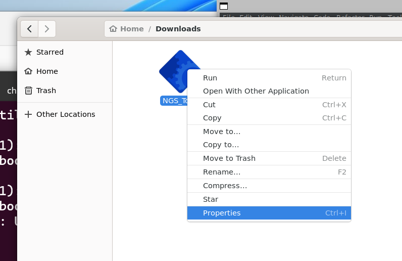
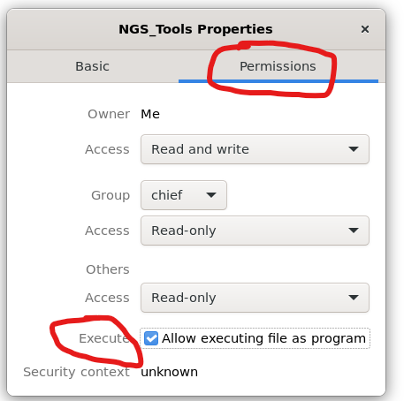
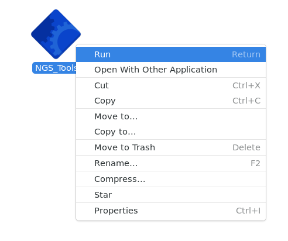
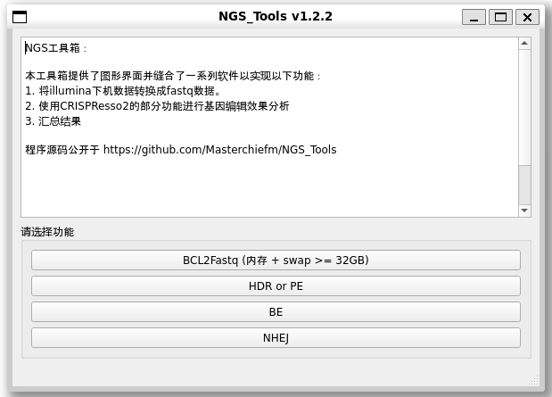
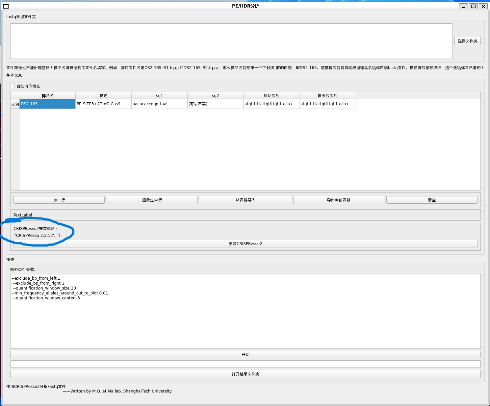

# NGS 小工具箱
## 目的
提供图形界面，让不会命令行的人也可以使用生信工具简便地分析基因编辑效果。

## 功能
1. 提供图形化的bcl2fastq界面，可以拆分下机数据（demultiplex）。
详细说明请查阅[illumina说明](https://support.illumina.com/sequencing/sequencing_software/bcl2fastq-conversion-software.html)
2. 提供[CRISPResso2](https://github.com/pinellolab/CRISPResso2)
的图形操作界面，可以批量分析HDR，PE，BE，NHEJ.
3. 收集编辑数据，并汇总到excel表。
4. 一键安装分析环境


## Cite this work

If this work helps, please cite my work.


It is recommended that citing the script by a link (such as: NGS_Tools(https://doi.org/10.5281/zenodo.8243045)) or refer to this page [Ways to cite a GitHub Repo](https://www.wikihow.com/Cite-a-GitHub-Repository)to promote reproducibility of your work.


## 视频教程
[Bilibili-不会Linux也能自己用扩增子测序分析基因编辑效率](https://www.bilibili.com/video/BV1q84y1w7HH/)

看完记得投币


## 在Windows运行（不推荐！）
本程序只能在Linux系统中运行，如果你使用Windows，也不是不能用，在Windows的Linux子系统里也能运行该程序，只不过要稍微配置一下。

或者下载Virtual Box，在虚拟机里安装Ubuntu等系统来运行该程序也行。

若使用Linux Subsystem for Windows(WSL)，请参[阅该指南](Windows_HELP/HELP_WIN.md) 进行配置，配置完成后**继续查看在Linux系统运行**
的相关内容。这个指南里有视频。


## 在Linux系统运行（推荐）
系统要求：
1. 必须安装中文系统，英文系统可能会有字符乱码。若遇到字符乱码，请自行为系统添加中文字体
2. 使用以下任一个发行版均可
```
Ubuntu Desktop
Cent OS
UOS （统一操作系统）
Deepin OS （深度操作系统）
```


配置要求：
```
bcl2fastq需要 内存 + swap分区至少32GB，推荐使用32GB以上内存
CPU建议8核心以上
```

## 运行
1. 无需安装，下载即可使用。

下载链接：

[Gitee Release](https://gitee.com/MasterChiefm/NGS_Tools/releases/latest)

或者

[GitHub Release](https://github.com/Masterchiefm/NGS_Tools/releases/latest)

---

2. 下载后右键点击属性



-----

3. 在权限中勾选允许作为可执行程序,然后关闭窗口



----
4. 右键点击程序，点击运行，或者直接双击运行



----
5. 选择需要的功能


---

6. 第一次使用务必安装分析环境

若未安装，此处会有提示，若已安装，会如图显示,
安装过程中会卡顿较长时间，前台无输出，请耐心等待



## 从源码运行本程序

首先需要准备一台有Linux系统的电脑，推荐Ubuntu22.04。使用Windows的Linux子系统也可，但是需要有WSL2图形支持。WSL2的配置请参阅[此处](Windows_HELP/HELP_WIN.md)。

1. 下载源码
```
# 下载
git clone https://github.com/Masterchiefm/NGS_Tools.git

＃ 进入下载的源码目录
cd NGS_Tools
```

2. 安装依赖
```
pip install -r requirements.txt
```

3. 运行
```
python3 ./NGS_Tools.py
```

根据以上操作，即可运行本程序的图形界面。图形界面操作按照图形提示即可。或者参考以下视频。

您也可以自由打包、分发，但是请注明来源。本随缘提供二进制文件。

# 参数设置
请关注质控、分析窗口这两个参数!这两个参数对结果有显著影响。[点击此处进行阅读](https://gitee.com/MasterChiefm/NGS_Tools/blob/master/help/parameters.md)

## 写在最后
本程序的初衷是为了为本组提供方便快捷的数据分析支持，希望能够帮助到别人的同时得到认可。写程序不是随便敲敲键盘就能搞定的事情，一样要付出很多的精力。

祝大家科研顺利！
