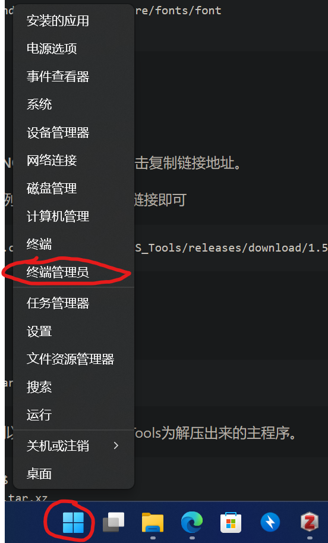
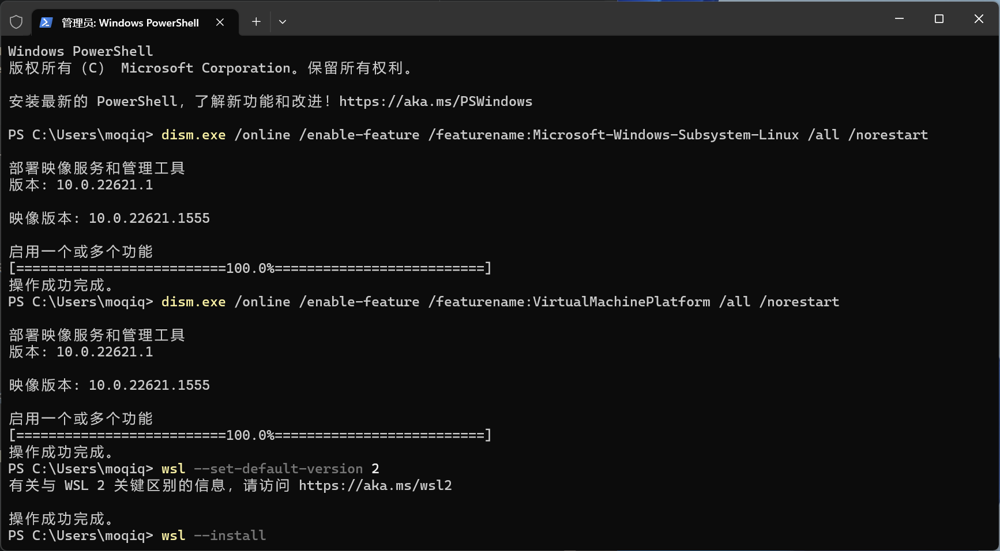
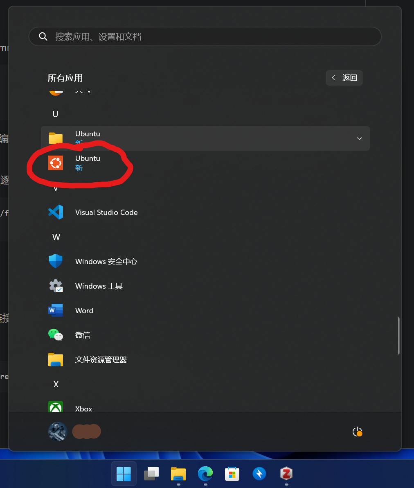
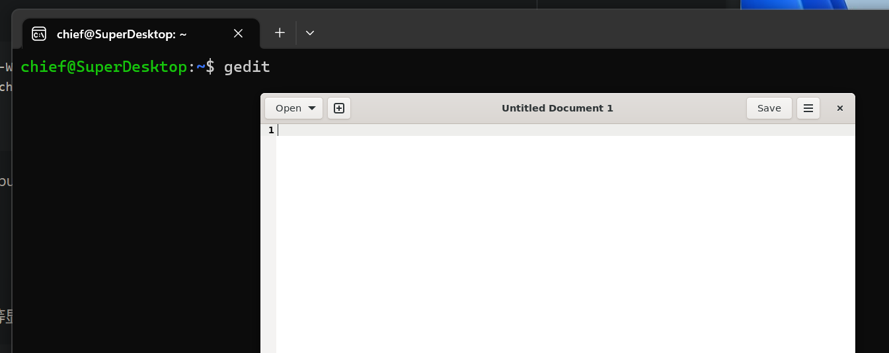
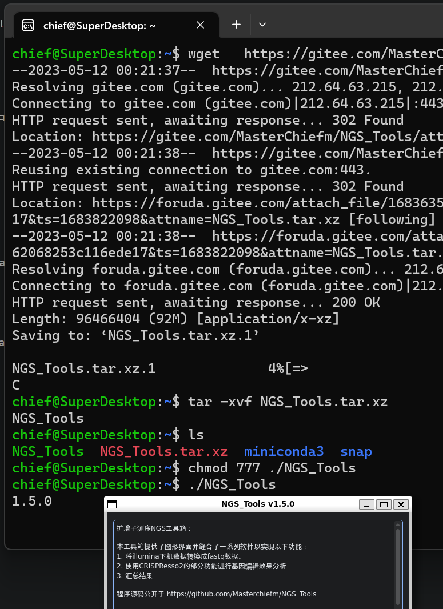
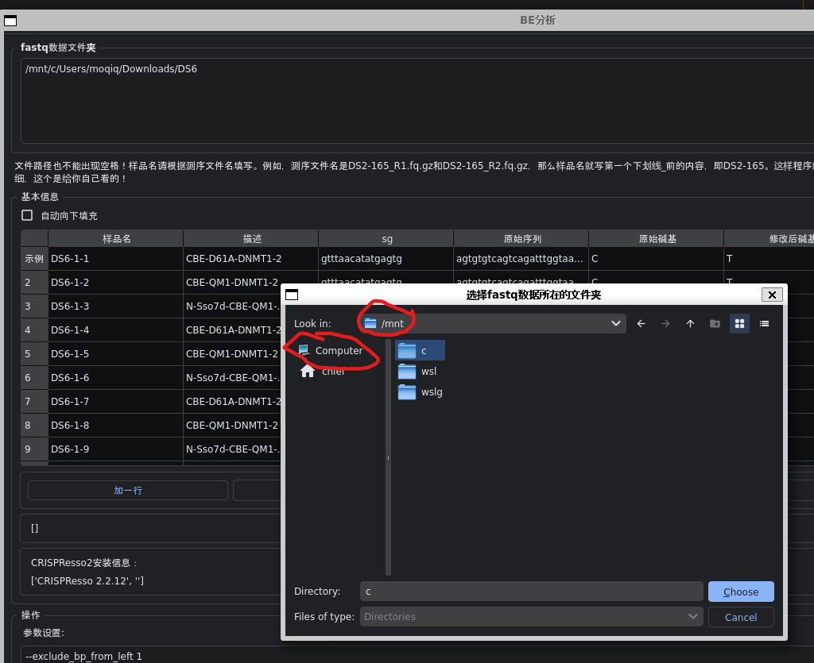

# 在Windows操作系统中使用


## 系统需要
```
推荐使用 Windows 11 操作系统，Windows 10 系统也可。

```


## 安装顺序

1. 安装Linux子系统(Ubuntu WSL2)
2. 配置Ubuntu WSL2运行GUI
3. 下载、解压程序
4. 运行程序

## 安装Linux子系统
右键单击开始图标，选择“终端管理员”或者PowerShell（管理员）
，

然后逐行运行以下指令。（推荐使用Windows11）

```
dism.exe /online /enable-feature /featurename:Microsoft-Windows-Subsystem-Linux /all /norestart
dism.exe /online /enable-feature /featurename:VirtualMachinePlatform /all /norestart
wsl --set-default-version 2
wsl --install
```



等待WSL安装完成后，请重启电脑。然后在开始菜单中找到Ubuntu图标，点击运行。

在Ubuntu终端中，设置好用户名、密码即可。



## 配置Ubuntu WSL2运行GUI
安装gedit文本编辑器，安装的时候会同时安装x11-common等显示图形界面所必须的软件
```
sudo apt update
sudo apt install gedit -y
gedit
```
逐条运行以上命令，运行了gedit后，若弹出一个文本编辑窗口，说明你的电脑已经可以支持运行Linux图形程序。若无法弹出，则根据报错参考[此处](https://learn.microsoft.com/zh-cn/windows/wsl/install)



配置中文字体支持。WSL2的图形程序无法显示中文，逐行运行以下命令以支持中文显示
```
sudo ln -s /mnt/c/Windows/Fonts /usr/share/fonts/font
fc-cache -fv
```

## 下载、运行程序
1）下载程序

进入[下载页](https://gitee.com/MasterChiefm/NGS_Tools/releases/latest)，
右键点击**NGS_Tools.tar.xz**，点击复制链接地址。

在Ubuntu终端中下载，例如以下，自行替换链接即可
```
wget   https://gitee.com/MasterChiefm/NGS_Tools/releases/download/1.5.0/NGS_Tools.tar.xz
```

2）解压程序

使用以下命令解压：
```
tar -xvf NGS_Tools.tar.xz
```
解压后，输入ls，能看到以下文件,其中NGS_Tools为解压出来的主程序。
```
chief@SuperDesktop:~$ ls
NGS_Tools  NGS_Tools.tar.xz
chief@SuperDesktop:~$
```

3） 运行程序
赋予程序可执行权限
```
chmod 777 ./NGS_Tools
```
运行程序：
```
./NGS_Tools
```


## 结果输出路径
注意，在Linux子系统中，Windows的C盘，D盘将会被链接到 /mnt/c 或者 /mnt/d ,所以在选择输出路径的时候，建议选择在 /mnt/d 以内的文件夹。不建议存在C盘，C盘可能存在读写权限问题。我这电脑只有C盘所以截图中只有一个"c"文件夹。**输出路径禁止存在空格、中文以及特殊符号！**



